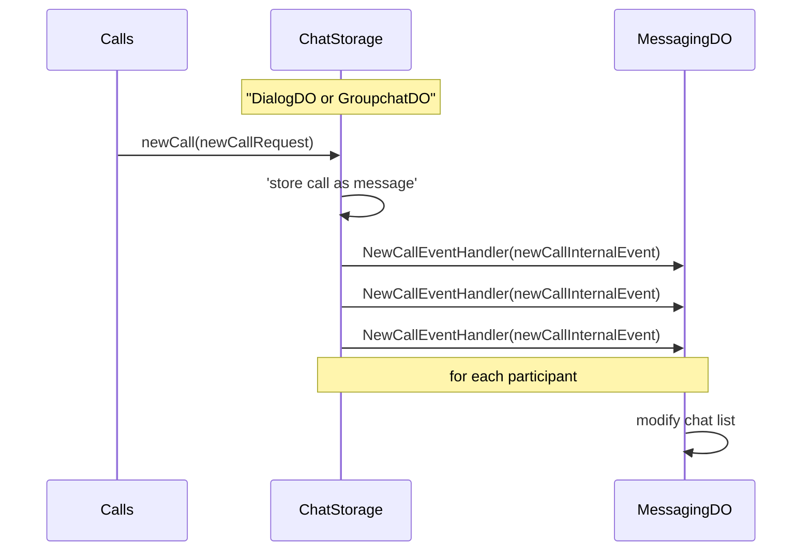

```mermaid
sequenceDiagram
    participant Calls
    Note over ChatStorage: "DialogDO or GroupchatDO"
    participant ChatStorage
    participant MessagingDO

    Calls->>ChatStorage: newCall(newCallRequest)
    ChatStorage->>ChatStorage: 'store call as message'
    ChatStorage->>MessagingDO: NewCallEventHandler(newCallInternalEvent)
    ChatStorage->>MessagingDO: NewCallEventHandler(newCallInternalEvent)
    ChatStorage->>MessagingDO: NewCallEventHandler(newCallInternalEvent)
    Note OVER   ChatStorage,MessagingDO: for each participant
    MessagingDO->>MessagingDO: modify chat list
```
